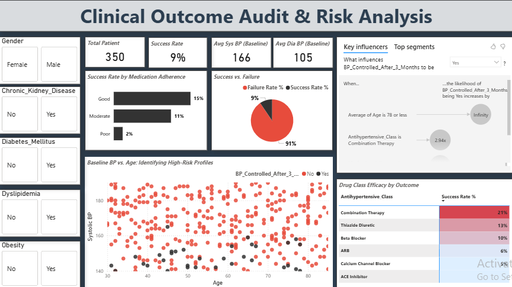

# Clinical Decision Support Model for Hypertension Management

## Project Overview

This project uses data from 350 hypertensive patients to answer two questions a clinic would care about:

1. Which patients are likely to fail to reach blood pressure control within three months?
2. Which patient factors and treatments are linked to better outcomes?

It combines exploratory analysis in Python, a Random Forest classification model, and a Power BI dashboard for non-technical stakeholders. The aim is to move from describing what happened to flagging at-risk patients early, so care teams can act sooner.

## Data

- **Source:** an anonymized hypertension dataset from a cardiology center, shared publicly by a physician for an open data challenge. I joined the challenge, completed this analysis, and presented the findings in a review session.
- **Size:** 350 patients, 16 columns, no missing values.
- **Fields:** age, gender, comorbidities (diabetes, chronic kidney disease, dyslipidemia, obesity), baseline and follow-up blood pressure, antihypertensive drug class, medication adherence (Good, Moderate, Poor), number of visits, and whether blood pressure was controlled after three months.

## Clinical Problem

Uncontrolled hypertension is a major driver of heart disease, stroke and kidney damage. In this cohort:

- **90.6% of patients (317) did not reach blood pressure control** within three months.
- Only **9.4% (33)** did.
- The average drop in systolic BP was 14.5 mmHg. Patients who reached control dropped 22.3 mmHg on average, against 13.7 mmHg for those who did not.

## Key Findings From the Analysis

### 1. Starting blood pressure matters most

Patients who reached control started with a mean systolic BP of **147.9 mmHg**, compared with **167.8 mmHg** for those who did not. The higher a patient starts, the harder control becomes within three months.

### 2. Medication adherence is the strongest behavioral factor

| Adherence | Reached control |
|---|---|
| Good | 15.2% |
| Moderate | 11.4% |
| Poor | 1.8% |

Patients with poor adherence almost never reached control.

### 3. Chronic kidney disease lowers the chance of control

| CKD | Reached control |
|---|---|
| No | 11.9% |
| Yes | 7.1% |

Diabetes, obesity and dyslipidemia showed almost no difference on their own (all within 8.6% to 10.4%).

### 4. Drug class success rates

| Drug class | Reached control |
|---|---|
| Combination Therapy | 21.1% |
| Thiazide Diuretic | 13.1% |
| Beta Blocker | 9.8% |
| ARB | 5.9% |
| Calcium Channel Blocker | 5.2% |
| ACE Inhibitor | 0.0% (0 of 45 patients) |

Within subgroups, combination therapy had the highest success rate among diabetic patients (25.0%), and thiazide diuretics had the highest among CKD patients (17.6%). These subgroups are small, and patients were not randomly assigned to drugs, so these are patterns worth investigating, not proof that one drug works better.

### 5. A simple three-factor risk score

I built a basic risk score giving one point each for baseline systolic BP above 165 mmHg, chronic kidney disease, and poor adherence:

| Risk score | Reached control |
|---|---|
| 0 | 36.5% |
| 1 | 9.0% |
| 2 | 0.8% |
| 3 | 0.0% |

Even this simple rule separates patients clearly, which supports the model findings below.

## Machine Learning Model

### Setup

- **Target:** blood pressure controlled after three months (1 = Yes, controlled; 0 = No, not controlled).
- **Features (11):** age, baseline systolic BP, baseline diastolic BP, number of visits, diabetes, CKD, dyslipidemia, obesity, and medication adherence (one-hot encoded as Good, Moderate, Poor).
- **Encoding:** Yes/No comorbidities mapped to 1/0; adherence one-hot encoded.
- **Split:** 80% training (280 patients), 20% test (70 patients), fixed random state for reproducibility.
- **Class imbalance:** SMOTE applied to the **training data only**, balancing it to 252 patients per class. The test set was left untouched so evaluation reflects the real imbalance and avoids data leakage.
- **Model:** Random Forest Classifier (100 trees).


### Results on the held-out test set (70 patients)

|  | Predicted: not controlled | Predicted: controlled |
|---|---|---|
| **Actually not controlled (65)** | 63 | 2 |
| **Actually controlled (5)** | 1 | 4 |

| Class | Precision | Recall | F1 |
|---|---|---|---|
| Not controlled (65 patients) | 0.98 | 0.97 | 0.98 |
| Controlled (5 patients) | 0.67 | 0.80 | 0.73 |

**What this means:**

- The model correctly flagged **63 of 65 patients (97%) who failed to reach control**. These are the patients a clinic would want to follow up more closely.
- It correctly identified **4 of 5 patients (80%) who did reach control**.
- Overall accuracy was 96%, but accuracy is not the right headline here. A model that predicted "not controlled" for every patient would already score about 93%, because 65 of the 70 test patients were not controlled. Recall for each class is the more honest measure, and it is the reason SMOTE was used.

.png>)

### What drives the predictions

| Feature | Importance |
|---|---|
| Baseline systolic BP | 0.386 |
| Baseline diastolic BP | 0.279 |
| Poor medication adherence | 0.122 |
| Chronic kidney disease | 0.057 |
| Age | 0.053 |

The model agrees with the exploratory analysis: starting blood pressure, adherence and kidney disease matter most.

.png>)

## Power BI Dashboard

The Power BI dashboard presents the same insights for non-technical stakeholders:

- Treatment outcome distribution
- Patient segmentation by risk profile
- Drug class effectiveness comparison
- Outcomes across comorbidities



## Recommendations

- Screen patients at the point of prescription using baseline BP, adherence and CKD status to flag high-risk patients early.
- Put adherence support (reminders, follow-up calls, counseling) in place for patients with poor adherence, since they almost never reached control.
- Review why ACE inhibitors showed no successful outcomes in this cohort before drawing conclusions.
- Validate these findings on a larger dataset before using them to guide treatment choices.

## Limitations

- **Small dataset:** 350 patients, with only 33 who reached control.
- **Very small test group for the controlled class:** only 5 patients in the test set reached control, so the 80% recall for that class could change a lot with more data.
- **Single train/test split:** results come from one 80/20 split. Cross-validation would give a more reliable estimate and is the next step.
- **Observational data:** patients were not randomly assigned to drug classes, so drug comparisons may reflect who received each drug rather than how well it works.
- **Drug class and gender were not used as model features** in this version.
- **Generalization:** results come from one center and may not hold for other populations.

## Next Steps

- Add stratified k-fold cross-validation to get a more stable performance estimate.
- Test drug class as a model feature.
- Compare the Random Forest against a simpler baseline such as logistic regression.
- Tune the decision threshold to favor catching high-risk patients.

## Tech Stack

- **Analysis:** Python, pandas, NumPy
- **Visualization:** Matplotlib, Seaborn, Power BI
- **Machine learning:** scikit-learn (Random Forest Classifier), imbalanced-learn (SMOTE)
- **Evaluation:** classification report, confusion matrix, feature importance

## Repository Structure

```
Clinical-Decision-Support-Model-for-Hypertension-Management/
├── Hypertension_Management.ipynb      Analysis and model notebook
├── assets/
│   ├── Dashboard.png                  Power BI dashboard screenshot
│   ├── model_outputs/                 SMOTE, confusion matrix and feature importance charts
│   └── presentation/                  Power BI file, dashboard PDF and presentation
└── README.md
```

## Author

**Udo Mary Imeabasi**
Data Science and Analytics | Healthcare AI | Python and Power BI
[LinkedIn](https://www.linkedin.com/in/udomary)
